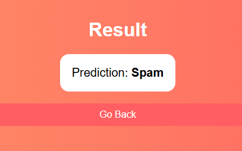

# Spam Mail Classifier

A web-based Spam Message Detector built using **Flask**, **Python**, and **Machine Learning (Naive Bayes)**.  
This project allows users to enter a text message and checks whether it's **Spam** or **Not Spam**, showing the model's confidence score.  

---

##  Features

-  Train a spam classifier using Naive Bayes  
-  Flask web app with a **modern colorful UI**  
-  Real-time prediction of Spam or Not Spam  
- Displays **model confidence percentage**  
-  Clean and simple project structure  

---

##  Project Structure

## Installation

1. **Clone or Download** the project

2. Navigate to the project folder:
    cd spam-mail-classifier

3.  Install dependencies:
    pip install flask pandas scikit-learn

4. Train the model:
python model_train.py
This will create spam_classifier_model.pkl.

5. Run the Flask app:
  python app.py

6. Open your browser and go to:

  http://127.0.0.1:5000/

 Model
Algorithm: Multinomial Naive Bayes

Feature extraction: Count Vectorizer

Dataset: SMS messages labeled as ham (not spam) or spam

Pipeline: Combines vectorization + classifier for easy deployment

 UI Preview
Input page: Enter your message to check

Result page: Shows prediction (Spam / Not Spam) with confidence score

Styled with modern colors and responsive design

 Future Enhancements
Add prediction history (track previous messages in a session)

Add file upload option for bulk message detection

Use TF-IDF Vectorizer for better accuracy

Deploy to cloud platforms like Heroku or AWS

 Author
Developed by R.Dharani sri.

